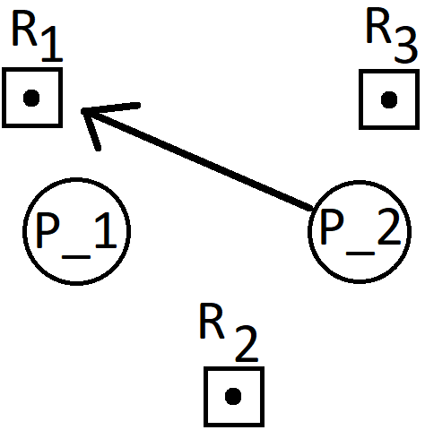
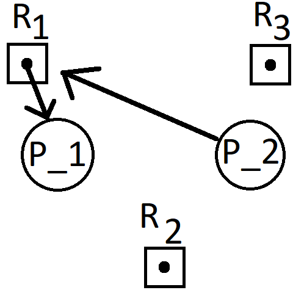
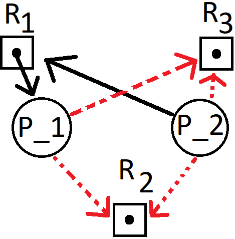

# Name: Matthew Mendoza

- [Name: Matthew Mendoza](#name-matthew-mendoza)
  - [Homework - Assignment 4](#homework---assignment-4)
    - [1. What is the formal definition of the deadlock?](#1-what-is-the-formal-definition-of-the-deadlock)
    - [2. What are the four requirements for a deadlock?](#2-what-are-the-four-requirements-for-a-deadlock)
    - [3. Suppose that a resource allocation graph contains a cycle. Does this mean there is a deadlock?](#3-suppose-that-a-resource-allocation-graph-contains-a-cycle-does-this-mean-there-is-a-deadlock)
    - [4. Suppose that a resource allocation graph does not contain a cycle.  Does this mean there is no deadlock?](#4-suppose-that-a-resource-allocation-graph-does-not-contain-a-cycle--does-this-mean-there-is-no-deadlock)
    - [5. Consider a system with processes P1 and P2 and resources R1, R2, R3 (where each resource has a single instance). Draw a resource allocation graph for each of the following steps in the sequence and answer the following questions](#5-consider-a-system-with-processes-p1-and-p2-and-resources-r1-r2-r3-where-each-resource-has-a-single-instance-draw-a-resource-allocation-graph-for-each-of-the-following-steps-in-the-sequence-and-answer-the-following-questions)
      - [a. Process P2 requests resource R1](#a-process-p2-requests-resource-r1)
      - [b. Process P1 is granted access to R1](#b-process-p1-is-granted-access-to-r1)
      - [c. Processes both P1 and P2 claim both resources R2 and R3](#c-processes-both-p1-and-p2-claim-both-resources-r2-and-r3)
    - [6. Consider a three process system in which processes may request any of 12 drives. Suppose the allocation state given below. Show that the allocation state is unsafe. Will this system deadlock?](#6-consider-a-three-process-system-in-which-processes-may-request-any-of-12-drives-suppose-the-allocation-state-given-below-show-that-the-allocation-state-is-unsafe-will-this-system-deadlock)
      - [Step 1 - Always use a top-down scan](#step-1---always-use-a-top-down-scan)
      - [Step 2](#step-2)
      - [Step 3](#step-3)

## Homework - Assignment 4

### 1. What is the formal definition of the deadlock?

> Process in the set is waiting for an event that only another process in the
> set can cause.
>
> > **Analogous Example**:
> >
> > **An interviewer asks**: "What is Deadlock?"
> >
> > **You answer**: "Hire me and I'll tell you."

### 2. What are the four requirements for a deadlock?

> The four requirements for a deadlock are
>
> 1. Mutual Exclusion – not required for sharable resources
> (e.g., read-only files); must hold for non-sharable resources
>
> 2. Hold and Wait – must guarantee that whenever a process requests a
> resource, it does not hold any other resources
>
> 3. No preemption: if the process requests a resource that cannot be allocated
> immediately
>
> 4. Circular wait: impose a total ordering of all resource types, and require
> each process to request resources in an increasing order of enumeration.

### 3. Suppose that a resource allocation graph contains a cycle. Does this mean there is a deadlock?

> If no cycle exists in the resource allocation graph, there is no deadlock;
> however, if there is a cycle in the graph and each resource has only one
> instance, then there is deadlock.
>
> A cycle is a necessary and sufficient condition for deadlock.

### 4. Suppose that a resource allocation graph does not contain a cycle.  Does this mean there is no deadlock?

> If a resource-allocation graph contains no cycles, then the system is not
> deadlocked.

### 5. Consider a system with processes P1 and P2 and resources R1, R2, R3 (where each resource has a single instance). Draw a resource allocation graph for each of the following steps in the sequence and answer the following questions

#### a. Process P2 requests resource R1

#### b. Process P1 is granted access to R1

#### c. Processes both P1 and P2 claim both resources R2 and R3

### 6. Consider a three process system in which processes may request any of 12 drives. Suppose the allocation state given below. Show that the allocation state is unsafe. Will this system deadlock?

|      | Allocation |  Max  | Need  | Available |
| :--- | :--------: | :---: | :---: | :-------: |
| P0   |     5      |  10   |   5   |    12     |
| P1   |     2      |   4   |   2   |     -     |
| P2   |     3      |   9   |   6   |     -     |

#### Step 1 - Always use a top-down scan

Because $P_0$’s $Need\:\le \:Available\:=\:12$, $P_0$ can run and returns
its allocated 5, making the new $Available\:=\:12+5\:=\:17$.

|      | Allocation |  Max  | Need  | Available |
| :--- | :--------: | :---: | :---: | :-------: |
| P0   |     -      |  10   |   -   |    17     |
| P1   |     2      |   4   |   2   |     -     |
| P2   |     3      |   9   |   6   |     -     |

#### Step 2

Then, $P_1$ can run because its $Need\:=\:2\:\le \:Available\:=\:17$.
After $P_1$ finishes its work, its $Allocation\:=\:2$ is returned to Available,
and the new $Available\:=\:17\:+\:2\:=\:19$.

|      | Allocation |  Max  | Need  | Available |
| :--- | :--------: | :---: | :---: | :-------: |
| P0   |     -      |  10   |   -   |    19     |
| P1   |     -      |   4   |   -   |     -     |
| P2   |     3      |   9   |   6   |     -     |

#### Step 3

> $P_2$’s $Need\:=\:3\:\le \:Available\:=\:17$, $P_2$ can run with no blocks...
>
> For this reason, this system is in a safe state and `<` $P_2$,$P_1$,$P_0$ `>`
> is a safe sequence

    Note to self: When not given the Need array we need to calculate it

|      | Allocation |  Max  | Need  | Available |
| :--- | :--------: | :---: | :---: | :-------: |
| P0   |     5      |  10   |   -   |    12     |
| P1   |     2      |   4   |   -   |     -     |
| P2   |     3      |   9   |   -   |     -     |

|      | Allocation |  Max  | Need  | Available |
| :--- | :--------: | :---: | :---: | :-------: |
| P0   |     5      |  10   |  *5*  |    12     |
| P1   |     2      |   4   |  *2*  |     -     |
| P2   |     3      |   9   |  *6*  |     -     |
