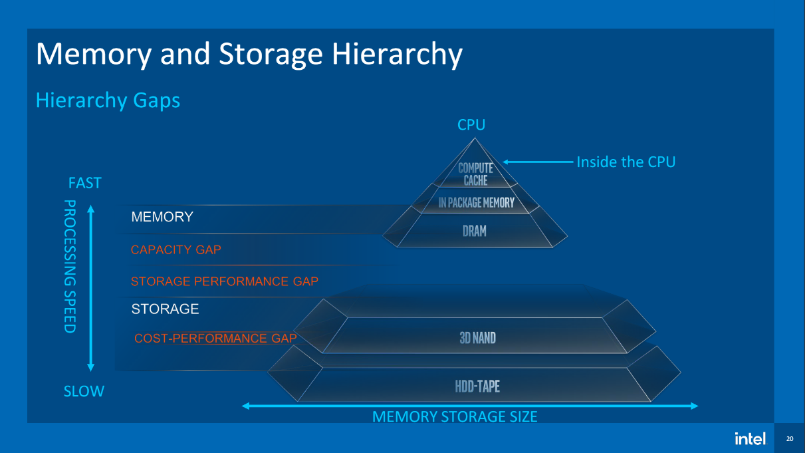
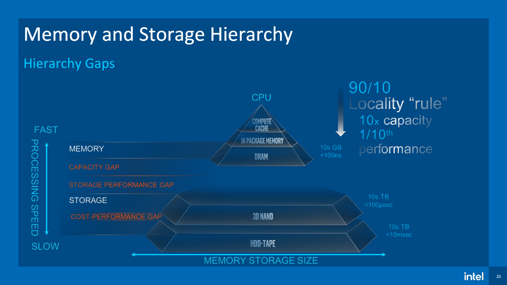
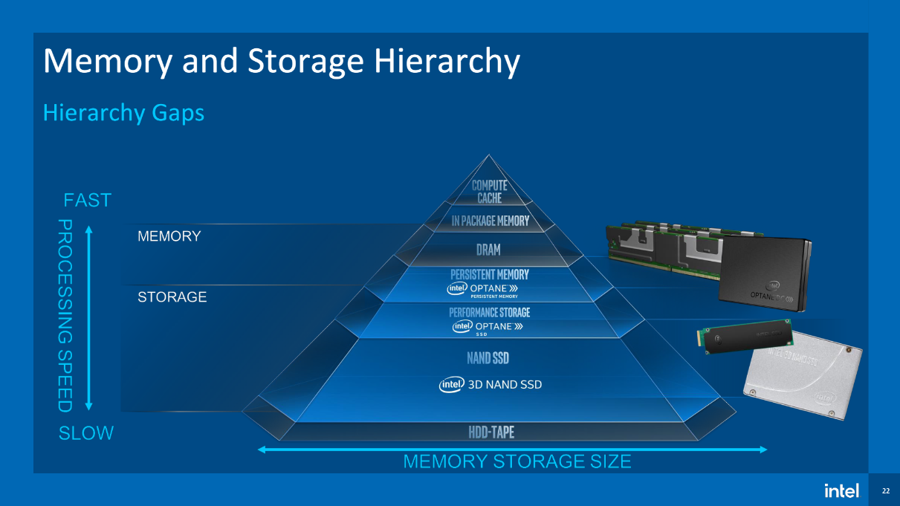

# CSC 139 - Handout 1 - Operating System Concepts

## 1. What are three main purposes of Operating Systems?

**OS is a computer resource manager**:

- Manages all computer HW and SW resources
- Resolves conflicting requests, deciding for efficient and fair resource use

**OS is a control program**: Controls execution of programs to prevent errors
or improper use of computer

## 2. Provide a brief overview of the role of a device controller in communicating with various device types

Each device controller is in charge of a specific type of device (for example,
a disk drive,audio device, or graphics display). A device controller maintains
some local buffer storage and a set of special-purpose registers. The device
controller is responsible for moving the data between the peripheral devices
that it controls and its local buffer storage.

## 3. Please lay out the steps on how an interrupt is handled by operating system

An interrupt “interrupts” regular flow of execution; transfers control to the
computer’s interrupt service rout ine, through so called interrupt vector,
which contains the address of each distinct service routine. Interrupt
architecture must save the address of the interrupted instruction and the
complete state of the interrupted SW

## 4. Draw the Storage device hierarchy, draw the storage capacity and access time along the hierarchy

<https://github.com/matt2ology/csus-computer-science-csc/blob/main/csc137-computer-organization/homework/submissions/ssd-presentation.pdf>

My internship was in Intel’s Memory and Storage Division before it got sold
off to SK Hynix…

## 5. Write the difference between Distributed system vs. Cloud computing system

Distributed computing refers to solve a problem over distributed autonomous
computers and they communicate between them over a network; in contrast, cloud
computing refers to providing on demand IT resources/services like server,
storage, database, networking, analytics, software etc. over internet. Also
there is no such thing as the “cloud” it’s just someone else’s computer…

## 6. Provide a brief outline of Multiprocessor and Clustered Systems

Multiprocessor: a CPU with multiple cores and Clustered Systems are a network
of systems sharing load balancing work loads and resources.

## 7. What the any three different type of data structure? Describe them in 1-2 sentences
